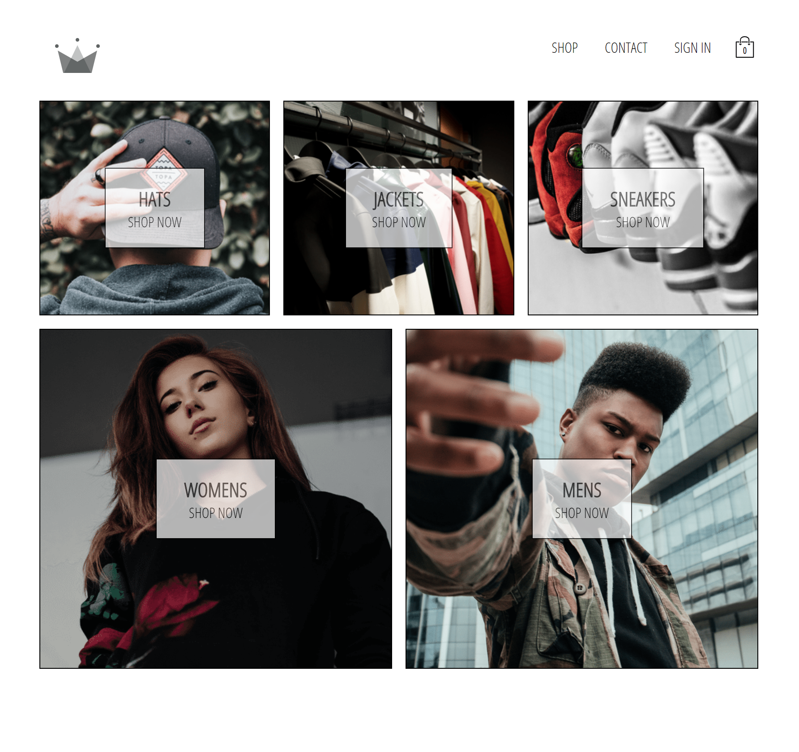

# Crown Clothing

## About The Project

[Crown Clothing](https://zeynebesendir.github.io/crwn-clothing) (e-commerce app) is an **ongoing project**.
 
I have been developing the app by following [ZTM React Developer Course](https://www.udemy.com/course/complete-react-developer-zero-to-mastery/).

The Project will be covering the following topics:
 * ~~React Basics~~
 * ~~React Router & Routing~~
 * ~~Firebase~~
 * ~~Redux~~   
 * ~~Session Storage~~  **👋I'm here!👋**
 * State Normalization
 * Stripe Payment Integration
 * HOC Patterns
 * Async Redux
 * Hooks
 * GraphQL
 * Testing
